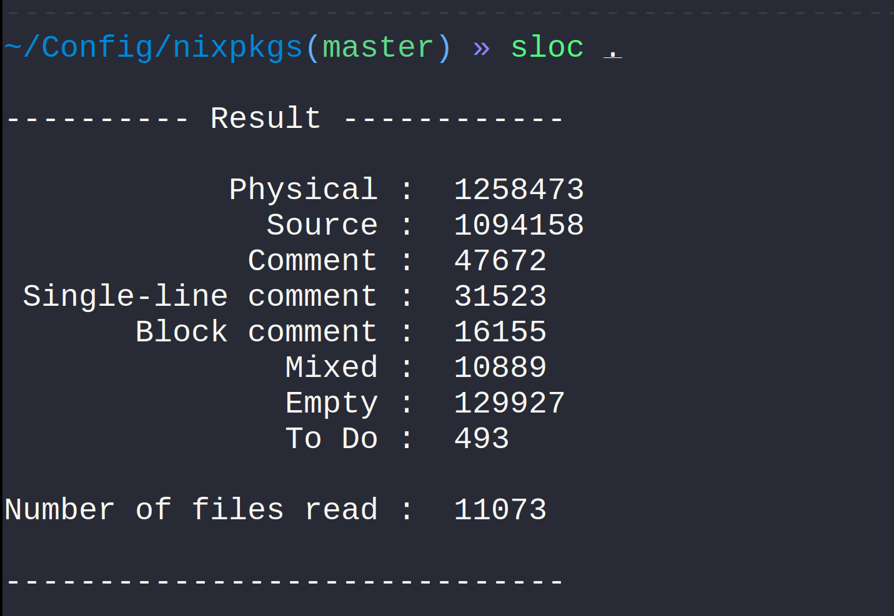

# Why

### Motivation

#### At the very begining…

> Nix won't be complete until it has static typing^[Eelco Dolstra]

#### Maintenance needs

- `nixpkgs`: 1M sloc

- Errors hard to spot

### Why isn't it done yet

```nix
lst:
  let
    x = head lst;
    y = elemAt lst 1;
  in
  if isString x
  then y.DOLLAR{x}
  else x + y
```

# How

### Requirements

- No compilation

- No syntax extension

- Type as much code as possible

- The ill-typed code must still be accepted

## Set-theoretic types

### Need for powerful types <!-- FIXME: very bad title -->

```nix
let
  f = x: y: if isInt x then x + y else x && y;
in f
```

→ Type of `f`?

`Int -> Int -> Int`, but also `Bool -> Bool -> Bool`

### Set-theory to the rescue (1)

\begin{center}
\begin{tikzpicture}
  \Huge
  \path[draw=c55ff55,fill=c55ff55,miter limit=4.00,fill opacity=0.392]
    (0,0) ellipse (3 and 2);
  \path[draw=cff5555,fill=cff5555,miter limit=4.00,fill opacity=0.392]
    (3,0) ellipse (3 and 2);
  \path (-1,0) node {A};
  \path (4,0) node {B};

    \path (-1,-4) node (dummy) {};
    \path<2-> (-1,-3) node (ACAPB) {A$\cap$B};
    \path[->,line width=2]<2-> (ACAPB) edge (1,-1);
\end{tikzpicture}
\end{center}

### We can do the same with types
\inlinetex{{\tiny (more or less)}}

- Union `$\cup$` → `$\vee$`
- Intersection `$\cap$` → `$\wedge$`
- Difference `$\backslash$` → `$\backslash$`
- Inclusion `$\subset$` → `$\subtype$`

### Back to our example

```nix
let
  f = x: y: if isInt x then x + y else x && y;
in f
```

`f` is of type `(Int -> Int -> Int) AND (Bool -> Bool -> Bool)`

## Gradual type

### Impossible to type everything

\ 

### Gradual type { - }

#### Let's introduce "`?`"

- Meaning: "I don't know what the type of this is, I trust you're only
  doing sane things with it"

- Used to type untypeable expressions

\begin{lstlisting}
  let x (*\only<2>{\color{lsttype}/*: ? */ }*)= getEnv "X"; in {y = 1}.DOLLAR{x}
\end{lstlisting}

## Bidirectional typing

### Type-inference too hard to do

```
x (*\only<2->{\color{lsttype}/*: \textbf{Int} */ }*): x+1
» (*\color{lstanswer}\textbf{\only<1>{?}\only<2->{Int}}*) -> Int
```

\def\iob{\textbf{Int} $\vee$ \textbf{Bool}}
```
x (*\only<3->{\color{lsttype}/*: \iob */ }*):
  if isInt x then -x else not x
» (*\color{lstanswer}\only<-2>{\textbf{?}}\only<3->{\iob}*) -> (Int OR Bool)
```

### Checking to the rescue

```
let f /*: (Int -> Int) AND (Bool -> Bool) */
  = x: if isInt x then -x else not x;
in f
» (Int -> Int) AND (Bool -> Bool)
```

### More power!

\def\intersIB{%
  \def\Bool{\textbf{Bool}}%
  \def\Int{\textbf{Int}}%
  \def\ra{\ensuremath{\to}}
  \Bool{} \ra{} \Bool{} \ra{} \Bool{} $\wedge$ \Int{} \ra{} \Int{} \ra{} \Int}

```
let f = (*\only<2->{\color{lsttype}/*: \intersIB{} */}*)
  x: y:
    if isInt x then x+y else x && y;
in f
» (*\color{lstanswer}\only<1>{? $\to$ ? $\to$ (\textbf{Int} $\vee$ \textbf{Bool})}%
    \only<2->{\intersIB{}}*)
```

### More precision

```
let f /*: Int -> Bool */ = x: (y: y) x; in f
```

- Without bidirectional typing: typechecs

- With bidirectional typing: type error

# What

## Base type-system

### Base stuff

```nix
let
  f /*: (Int $\to$ Int $\to$ Int) $\wedge$ (Bool $\to$ Bool $\to$ Bool) */
    = x: y: if isInt x then x + y else x && y;
in f
```

```nix
x /*: Int */:
  if x > 0
  then x-1
  else false
```

. . .

```
» Int -> (Int OR false)
```

## Data-structures

### Lists

#### Regular expression lists

```
[ 1 2 true ] /*: [ Int* true "bar"# ] */
[ true "bar" ] /*: [ Int* true "bar"# ] */
```

### Records − General form

#### Syntax of record types

```
{ $x_1$ $\approx$ $\tau_1$; …; $x_n$ $\approx$ $\tau_n$; _ =? $\tau$ }
```

Where `$\approx$` is `=` or `=?`

#### Syntactic sugar

- we can omitt `_ =? Empty` 
- we can replace `_ =? Any` by `..`

### Static records

```
{ x = 1; y = false; z = "foo" }
```

. . .

```
» { x = 1; y = false; z = "foo" }
```

### Dynamic records

```
let
  myFunction /*: Int -> String */ = …;
  x = getEnv "Foo";
in
{ DOLLAR{x} = 1; DOLLAR{myFunction 2} = true }
```

. . .

```
» { _ =? 1 OR true }
```

## Extensible system

### Possible modulations on the type-system {-}

```
{
  DOLLAR{e1} = 1;
  DOLLAR{e2} = 2;
}
```

→ Do we want to allow this?

### Gradual type sometimes unwanted

`(x: x)` is basically an unsafe cast

→ We would sometimes like to have more guaranties

- Don't automatically add gradual types everywhere

- Disable the gradual type

### Annotations to control the type-system {-}

```
((x: x) 1) (*\only<2->{\color{blue}/*\# strict-mode */} *)/*: Bool */
```

\only<1>{Typechecks}
\only<2>{Error}
